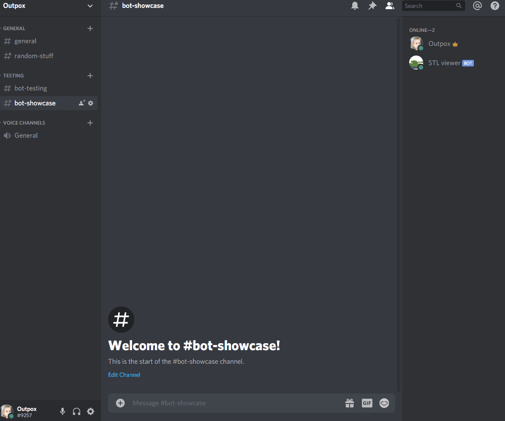
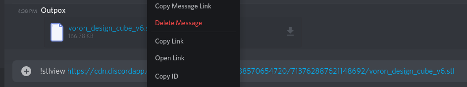

## STL Viewer  
STL Viewer is a Discord bot which goal is to generate a preview of a `.stl` file when shared in Discord instead of having to download it.  
It was developped in Node.js and Typescript using the Discord.js library. The preview image is generated with OpenSCAD.  
  
### Preview
  
  
### How to use
Right now two options are available: 
* `!stlview` will preview the latest `.stl` files uploaded by anyone in the current channel. (This behavior can be seen in the above gif) By default the bot will only look in the last 50 messages.
* `!stlview <discord download link>` If you want to generate a preview for a previous file or for a file from another channel or even from another Discord simply **right click** the **file name** and hit `Copy link` (and not `Copy link message`). If you got it right the link should include the file name at the end.  
    
    
### Inviting the bot
Sorry, for the moment the bot is still in development and as such I won't provide an invite link. It will be possible
once I'm satisfied with it. For the time being you can host it yourself if you really can't wait, see below.

### Configuration
The default configuration can be found in `config/default.json`.  
```jsonc
{
  // Your Discord bot token. Found in your bot section in your Discord application (https://discord.com/developers/applications/).
  "token": "",

  // How many messages in the past will the bot look for files. (Does not apply to direct links)
  "historyLimit": 50,

  // Where the temporary stuff happens, you shouldn't need to change this.
  "temporaryFolder": "tmp",

  // Allowed file formats.
  "validFormat": [".stl"],

  // Allowed domains to download the files from. Uploaded files are hosted on `https://cdn.discordapp.com`.
  "allowedOrigins": ["https://cdn.discordapp.com"],

  // Path to the openSCAD binary, `auto` will use included binaries (in `./utils`) depending on the operating system.
  "openSCADPath": "auto"
}
```

### Local development
If you want to edit or test the bot on your computer you will need Node.js 12+ and Linux (maybe macOS if it handles AppImages).  
Then after you've cloned the repository:  
```
npm ci
```
Create a file named `local-development.json` in the `config` folder and past your token:  
(You can get a token by creating an application and a bot for this application on the [developer portal](https://discord.com/developers/applications/))
```json
{
  "token": "INSERT YOUR TOKEN HERE"
}
```  
This file is .gitignored and that will prevent you from sharing it on the internet (which you absolutely should not do).  
Then run the bot with  
```
npm run dev
```  
It will reload itself after every saves.  
  
### Hosting the bot
As for local development, create an application on the [developer portal](https://discord.com/developers/applications/). (You don't need a new one if had one for local development).  
First create a file named `local-production.json` in the `config` folder and past your token:
```json
{
  "token": "INSERT YOUR TOKEN HERE"
}
```
Simply run
```
npm run production
```
in a `tmux` or `screen` or use PM2.  
  
### Upcoming features
* Allow changing the preview orientation
* Support `.3mf` files (and maybe more?)
* Improve preview display in Discord  
  
If you miss anything or have any question please open an issue. For now PR are not really welcome as I'm still working on the project but you can still open an issue for us to discuss it.  
I'm also available on Discord `Outpox#9257` or on the Voron community Discord.